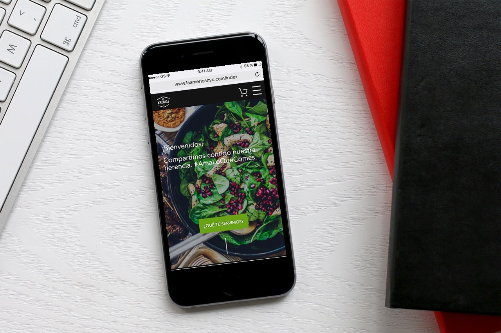
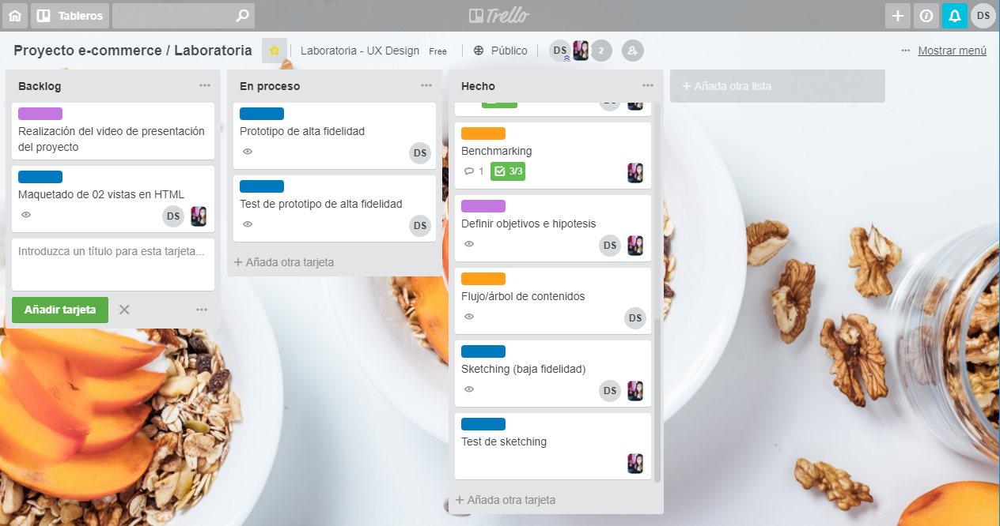
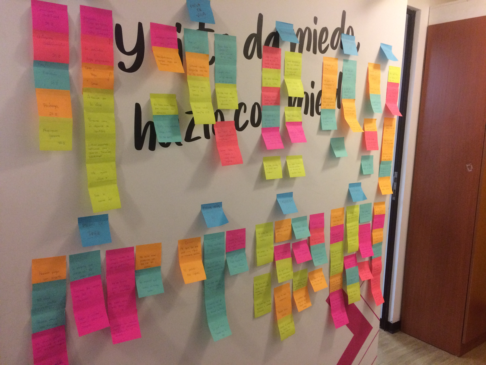
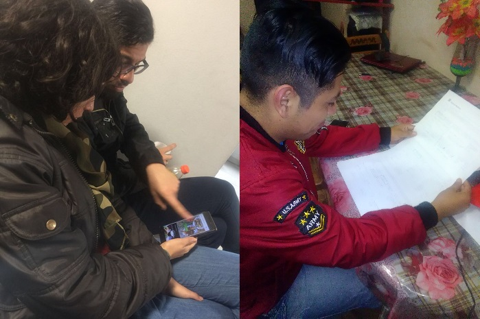
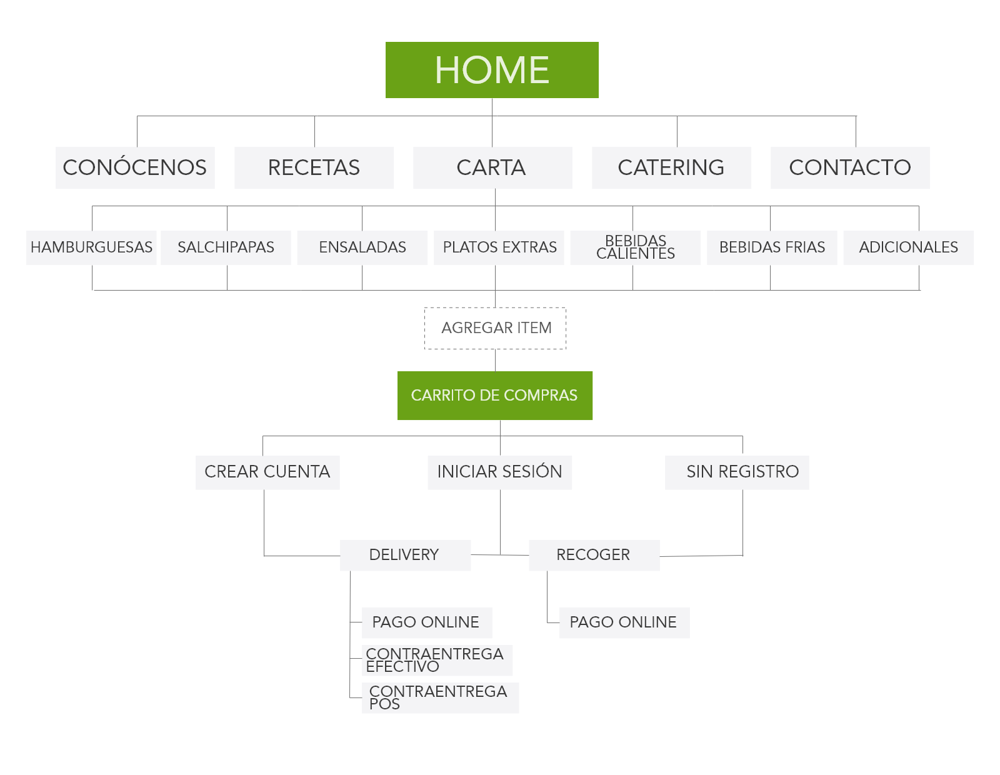

# Propuesta de plataforma en línea - La América H&C
[Visita nuestro proyecto en Wix aquí](https://danellylucia.wixsite.com/laamericahyc)

Hoy en día, el 78% de peruanos opta por alternativas orgánicas para su alimentación. Esta cifra, producto de un [estudio de la consultora Nielsen](http://www.nielsen.com/pe/es/insights/reports/2017/La-revolucion-de-los-alimentos-en-America-Latina-la-salud-es-una-prioridad-para-el-consumidor.html), refleja uno de los niveles más altos de consumo en la región latinoamericana.

A consecuencia de ello, se produce el nacimiento de un nuevo nicho de mercado en el Perú que va creciendo con rapidez en los últimos años: los restaurantes de comida saludable, a lo cual algunos especialistas han denominado “el segundo boom de la gastronomía peruana”, en donde el sabor y la salud caminan de la mano en búsqueda de rentabilidad.

En Lima, el mercado de restaurantes de comida saludable se centra en distritos como Barranco, Miraflores o San Isidro y sus productos suelen costar un 20% más de lo que cuesta un platillo en un restaurante convencional o de comida rápida. Sin embargo, para expandir el consumo y captar nuevos clientes, aparecen alternativas en distritos aledaños.

## 1. Introducción
Nos contactó la empresa La América H&C para asesorarlos en la creación de una plataforma virtual que le permita ofrecer sus productos y servicios a sus consumidores sin intermediarios.

Dicha empresa suele ofrecer sus servicios por delivery a residentes de Lince - donde están ubicados - y distritos aledaños a su local y se toman los pedidos a través del Facebook.

## 2. Sobre la empresa
La América H&C es un emprendimiento que nació en el 2016 como una alternativa a la variedad de comida rápida que primaba en la zona comercial de Lince.

La empresa ofrece a sus consumidores como principal producto una variedad de hamburguesas artesanales de carne y con alternativa vegetariana. Asimismo, ofrece acompañamientos como ensaladas de vegetales, jugos nutritivos, papas nativas, café orgánico, entre otros.

**Público objetivo**
Su público objetivo son personas residentes de Lince entre 21 a 35 años, quienes suelen ser trabajadores dependientes con horarios de oficina y con pocas opciones para comer comida saludable durante el día. A esto se debe su horario de 5:30 p.m. a 11:00 p.m.

## 3. Objetivos del proyecto

Crear una plataforma web online que refleje la identidad de la América y les permita ofrecer sus productos virtualmente y de manera ordenada.

### 3.1 Hipótesis
Al desarrollar una tienda virtual donde esten expuestos los productos de la  América se generarán más clientes fidelizados.

## 4. Planificación de actividades

|Actividad|Sustentación|
|:---|:---|
|Entrevistas con cliente| Es necesario para poder hacer el match entre lo que el cliente desea y lo que necesita el usuario. Asimismo, para conocer sus motivaciones, frustraciones y necesidades.|
|Benchmark| Es útil para conocer buenas prácticas y errores en páginas de referencia, y así definir mejor el contenido de lo que vamos a proponer. También nos servirá para conocer empresas competidoras del rubro. |
|Entrevistas con usuarios| Es útil para conocer las experiencias previas de los usuarios y sus necesidades. Ayudarán a identificar sus pains principales y posibles gains de la propuesta. |
|Flujo/árbol de contenidos| Permitirá ordenar el contenido de la propuesta y ver de forma esquemática la información que le mostraremos al usuario. |
|Sketching y wireframing| Nos servirá para diagramar y diseñar el contenido que queremos mostrar y a su vez verificar las funcionalidades de la propuesta. |
|Testeo de prototipos| Permitirá conocer la opinión y primera experiencia del usuario con los prototipos propuestos.  |
|Prototipado de alta fidelidad| Muestra final de la propuesta en prototipo clickeable y testeable. |

## 5. Proceso de research
Para iniciar el proceso de investigación planificamos las actividades elegidas a través de Trello, realizando de manera equitativa las actividades a cubrir por el equipo y el tiempo que nos iba a tomar.

### 5.1. Benchmarking

Para continuar con la investigación, realizamos un benchmarking de los competidores y empresas con buenas prácticas en venta de comida saludable en distritos aledaños. 

Escogimos 03 competidores directos:

**Yami Vegan:** Es un restaurante vegano que brinda delivery a través del teléfono. Está ubicado en la zona comercial de Lince, al igual que La América H&C, por lo que constituye una competencia directa. Sin emnbargo, su carta, al ser solo vegetariana o vegana, no ofrece mayor variedad a los diferentes públicos de la zona. No cuenta con página web, solo con Facebook e Instagram. Involucra a sus clientes con talleres y eventos. Su horario de funcionamiento es de 12:00m a 9:00p.m.

**Quinoa Café:** Es un restaurante/cafetería de comida orgánica ubicado en San Isidro y Jockey Plaza. Cuenta con página web y carrito de compras solo para pedidos del tipo "pick up" o para recoger. No hacen delivery directo, solo por Uber Eats. Su horario de funcionamiento es de 9:00 a.m. a 11:00 p.m.

**Raw Café Club:** Es un restaurante/cafetería ubicado en Miraflores. Cuenta con página web pero no con carrito de compras. Su delivery es a través de las redes sociales o por teléfono. Su horario de funcionamiento es de 9:00a.m. a 10:00p.m.

[Diapositivas con benchmarking](https://docs.google.com/presentation/d/1OxdFs8M69WDc_QeCTY03Izjy0lEriNldGmM5K0hnhnE/edit?usp=sharing)

**Conclusiones**

Se eligieron estas 03 empresas debido a que son ejemplos clave de negocios del rubro, 02 de ellos ubicados en distritos de alto tránsito comercial y 01 de ellos en el mismo distrito que La América H&C. 

Se descubrió que, aunque los 03 difieren en métodos de atención referente a delivery, cuentan con un público muy parecido que el de La América H&C, por lo que las modalidades, ya sean de envío o pick up son muy importantes. Asimismo, se notó que las páginas web son un gran respaldo a la imagen de las empresas, pues aquella que no contaba con web propia, tenía dificultades al mostrar sus productos y/o servicios con detalle.

### 5.2. Entrevista con el cliente
#### Guía de entrevista al cliente - La América H&C**

**Objetivos:**
* Obtener información sobre la empresa en sí y sus productos de forma más detallada.
* Conocer el público objetivo del cliente.
* Conocer el proceso de venta online del cliente.
* Conocer los pain-points del cliente en el proceso de venta online de sus productos.

**Inicio:**
Buenas tardes.______________, somos Danelly y Joselyn estudiantes de Laboratoria.
Muchas gracias por el tiempo que nos brindará durante la entrevista.

**Lista de preguntas:**
* ¿A qué se debe la elección del rubro?
* ¿Cómo ve su empresa de aquí a 3 años?
* ¿Qué imagen desea proyectar en el corto plazo?
* ¿Cuál considera que es su público objetivo?
* ¿Cómo logran fidelizar a sus clientes?
* ¿Qué productos son los que suelen vender más en tienda? ¿Y de manera online?
* ¿Por qué decidió realizar el servicio de delivery? ¿Por qué en bicicleta?
* ¿Cuál es su zona de reparto? ¿Por qué seleccionaron esa zona?
* ¿Cómo es su proceso de venta online? ¿Me puedes contar sobre la última venta online que recuerdes? (Facebook, Whatsapp, medios de pago, tiempo de preparación, comprobantes)
* ¿Alguna vez ha tenido algún inconveniente en la venta online?

[Link al audio de la entrevista.]()

**Conclusiones**
* El público objetivo definido por el cliente se delimita a personas que viven cerca del local y en distritos aledaños, puesto que su servicio de delivery intenta ser ecoamigable (en bicicleta), lo que es parte de su identidad como empresa.
* Sus productos estrella son las hamburguesas artesanales y los productos originales que ellos mismos producen.
* No tienen un seguimiento al detalle de los pedidos online, los cuales se hacen a través del Facebook, debido a la falta de personal, situación que planean cambiar en el mediano plazo.
* Los clientes que suelen pedir online son aquellos que ya han visitado previamente el local, por lo que el servicio de delivery se convierte en una oportunidad de fidelización muy importante.

### 5.3. Entrevista con usuarios
#### Guía de entrevista - La América H&C**

**Objetivos:**
* Obtener información sobre el tipo de usuario que consume en este negocio.
* Conocer su proceso de compra y pedido de servicios.
* Utilizar la información para elaborar el User Persona y Customer Journey Map.

**Inicio:**
Buenas tardes.______________, somos Danelly y Joselyn estudiantes de Laboratoria.
Muchas gracias por el tiempo que nos brindará durante la entrevista.

**Lista de preguntas:**
* ¿Cuál es su edad?
* ¿A qué se dedica?
* ¿Qué suele hacer en sus ratos libres?
* ¿Que suele comer los fines de semana o días que descansa?
* ¿Has escuchado sobre comida orgánica? /Si la respuesta es verdadera, continua la sgte pregunta, caso contrario omitir y continuar con la consiguiente/
* ¿Desde cuándo consume este tipo de comida? ¿Qué tan seguido lo realiza?
* ¿Cuántas veces a la semana consume en restaurante? ¿Qué platillo suele pedir?
* ¿Cómo se enteró del restaurante?
* ¿Recuerdas la última vez que comiste en ese restaurante? ¿Me puedes contar tu experiencia?
* ¿En qué momento eliges pedir comida por delivery? ¿Utiliza el pedido online o por llamada?
* ¿Recuerdas la última experiencia realizando pedido de comida por delivery?
* ¿Consideras que el servicio de delivery online es importante para un restaurante en estos días? ¿Por qué?
* ¿Qué es lo que más te gusta del proceso de delivery online?
* ¿Qué es lo que menos te gusta?
* Para finalizar, ¿Usted qué cree qué caracteriza un servicio de delivery exitoso?

[Link a audios de entrevistas con usuario]()

**Conclusiones**

¿Cómo son y qué desean los usuarios?
* Son usuarios que cuentan con poco tiempo libre pues trabajan todo el día, por lo que la llegar a casa prefieren ahorrar tiempo pidiendo un delivery mientras aprovechan el tiempo de envío en ocio o en hacer otras labores.
* Suelen hacer deporte en pocas cantidades, sin embargo, les gusta cuidar de su salud buscando algunas opciones más fáciles o rápidas que se adapten a su estilo de vida.
* Valoran la calidad de los productos, por lo que no tiene problema en esperar por el envío o el despacho de productos mientras estos "valgan la espera".
* Suelen buscar promociones en los pedidos de delivery online además de comparar imágenes o precios.
* Suelen confiar en un delivery de comida luego de haber probado previamente sus productos en tienda.
* Busca rapidez en los procesos de pago online pero también quiere estar protegido de posibles fallas o robo de información.

## 6. Definición del público objetivo

### 6.1. Mapa de afinidad
Para sintetizar la información de las entrevistas y observación en campo que realizamos, vaciamos toda la información en un mapa de afinidad y buscamos patrones que se repitan.

[Link Afinity Map al detalle](https://drive.google.com/drive/folders/16K4RDnUavXlz8KhF37Q4izEigBgKlDJg?usp=sharing)

### 6.2. User persona

Luego del proceso de investigación y con los resultados obtenidos en el mapa de afinidad pudimos elaborar el User Persona que nos servirá para plantear a detalle los contenidos y flujos del prototipo.

### 6.3. Customer journey map
* Actual

* Ideal

[Link customer journey map](https://drive.google.com/drive/folders/17vYzO1SsgIuF4Dm9eyz2--yUb_p6Mkmp?usp=sharing)

## 7. Testing con usuarios

Testeamos las propuestas de sketch y prototipo en alta fidelidad con usuarios frecuentes de servicios para validar y recoger sus opiniones.

### 7.1 Conclusiones
Conclusiones de testing con sketch:
* Se le hizo sencillo ingresar al menú de selección.
* Supo cómo agregar y quitar un ítem.
* No encuentra el horario de atención especificado.
* Encuentra irrelevante el buscador.
* No entiende a qué se refiere con "tiempo estimado".
* No entiende las opciones del sidebar; no son descriptivas.

Soluciones:
* Se implentará el horario de atención en la parte inferior.
* Se quitará el buscador y se incrementará ligeramente el tamaño del carrito y menú.
* Se quitará "tiempo estimado" de las opciones de pedido y se colocará al final, luego de finalizar la compra.
* Se plantearán textos más descriptivos en las opciones del sidebar.

Conclusiones de testing con prototipo de alta fidelidad:
* Pudo ingresar sin problemas a la sección de pedido.
* Pudo identificar cómo funciona la barra deslizable de opciones (hamburguesas, salchipapas, etc.).
* Pudo agregar items a su pedido.
* Le confunde el método de pedido; no sabe a donde ir después de agregar un ítem.
* No ubica el carrito de compras con facilidad.
* Le preocupa no saber a qué zonas llega el delivery.
* No puede leer bien las letras de los botones call to action.

Soluciones:
* Se colocará un botón flotante que enlazará con el carrito de compras directamente y también se agrandará el tamaño del icono del carrito.
* Se colocará la información de la zona de reparto en el footer del home.
* Se incrementará el tamaño de letra y mejorará el contraste de los botones.

## 8. Propuesta final

Nuestra propuesta de valor es crear una plataforma donde los usuarios puedan visibilizar los productos que La América H&C a través de categorías que puedan facilitar al usuario encontrar lo que está buscando fácilmente. 

Asimismo, el cliente, al ser una empresa que busca fidelizar y darse a conocer con usuarios nuevos, necesita también que en la plataforma se observe la descripción de su empresa y sus productos. Por eso, se plantea agregar una sección de "Nuestras recetas" en el home para que los usuarios puedan conocer con qué ingredientes y cómo están hechos los productos que ofrecen.

### 8.1. Flujo / árbol de contenidos

* User Flow
Primer planteamiento de User Flow que se realizó tras el primer acercamiento con el cliente. 

Tras las entrevistas con usuarios y conocer sus necesidades, se creo un segundo flujo de usuario y árbol de contenidos.

### 8.2. Prototipo final navegable

[Link a prototipo en Adobe XD - versión mobile](https://xd.adobe.com/view/088dd361-b02e-44b2-7c63-74d7caaca4de-7ebc/?fullscreen)

[Link a prototipo en Adobe XD - versión desktop](https://xd.adobe.com/view/1aace4ac-a2a9-47a4-64ea-c6f2f5f1b66a-6c9d/?fullscreen&hints=off)

[Link a código mobile en Zeplin](https://zpl.io/VYRnr4M)

[Link a código desktop en Adobe XD](https://xd.adobe.com/spec/8b7c47b6-0e9e-45cc-72e0-bf7f7fcf44b9-fd4d/screen/7222be90-50e0-4cdf-bb34-803661968e65/3-Market-3/)

## 9. Proyecto en Drive

[Link a proyecto en Google Drive](https://drive.google.com/drive/folders/1JW1e15XYr1ctluaSLhnEBGaMz2QVn9PW?usp=sharing)

## 10. Video en Loom

[Link a video en Loom](https://www.useloom.com/share/a9f5745b337049ba88b94a63603f0d2f)

## 11. Medium Post

[Link al Post en Medium](https://medium.com/@joselynsilva/la-am%C3%A9rica-proyecto-marketplace-105bcccbefaf)
