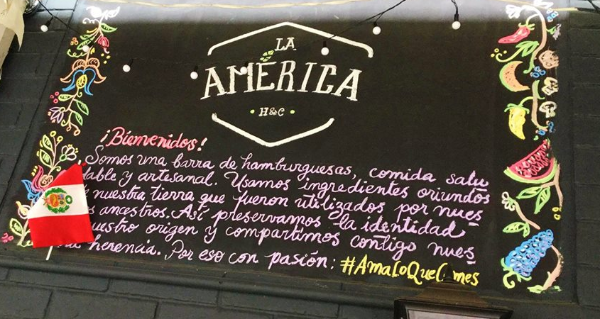
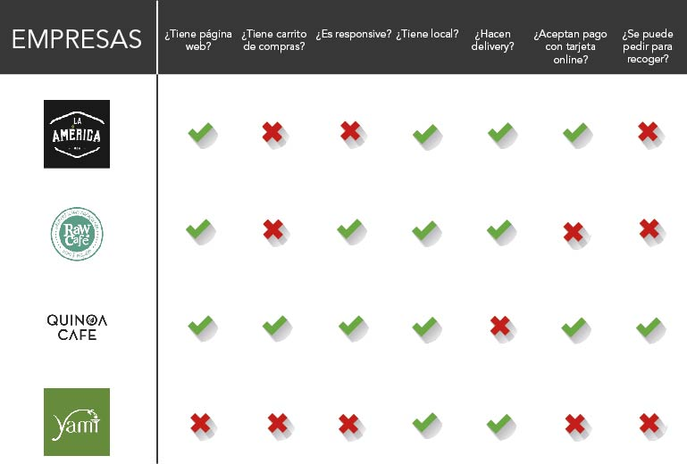

# Propuesta de plataforma en línea - La América H&C

Hoy en día, el 78% de peruanos opta por alternativas orgánicas para su alimentación. Esta cifra, producto de un [estudio de la consultora Nielsen](http://www.nielsen.com/pe/es/insights/reports/2017/La-revolucion-de-los-alimentos-en-America-Latina-la-salud-es-una-prioridad-para-el-consumidor.html), refleja uno de los niveles más altos de consumo en la región latinoamericana.

A consecuencia de ello, se produce el nacimiento de un nuevo nicho de mercado en el Perú que va creciendo con rapidez en los últimos años: los restaurantes de comida saludable, a lo cual algunos especialistas han denominado “el segundo boom de la gastronomía peruana”, en donde el sabor y la salud caminan de la mano en búsqueda de rentabilidad.

En Lima, el mercado de restaurantes de comida saludable se centra en distritos como Barranco, Miraflores o San Isidro y sus productos suelen costar un 20% más de lo que cuesta un platillo en un restaurante convencional o de comida rápida. Sin embargo, para expandir el consumo y captar nuevos clientes, aparecen alternativas en distritos aledaños.

## 1. Introducción
Nos contactó la empresa La América H&C para asesorarlos en la creación de una plataforma virtual que le permita ofrecer sus productos y servicios a sus consumidores sin intermediarios.

Dicha empresa suele ofrecer sus servicios por delivery a residentes de Lince - donde están ubicados - y distritos aledaños a su local y se toman los pedidos a través del Facebook.

## 2. Sobre la empresa
La América H&C es un emprendimiento que nació en el 2016 como una alternativa a la variedad de comida rápida que primaba en la zona comercial de Lince.

La empresa ofrece a sus consumidores como principal producto una variedad de hamburguesas artesanales de carne y con alternativa vegetariana. Asimismo, ofrece acompañamientos como ensaladas de vegetales, jugos nutritivos, papas nativas, café orgánico, entre otros.

**Público objetivo**
Su público objetivo son personas residentes de Lince entre 21 a 35 años, quienes suelen ser trabajadores dependientes con horarios de oficina y con pocas opciones para comer comida saludable durante el día. A esto se debe su horario de 5:30 p.m. a 11:00 p.m.

## 3. Objetivos del proyecto

Crear una plataforma web online que refleje la identidad de la América y les permita ofrecer sus productos virtualmente y de manera ordenada.

### 3.1 Hipotesis
Al desarrollar una tienda virtual donde esten expuestos los productos de la  América se generarán más clientes fidelizados.

## 4. Planificación de actividades

|Actividad|Sustentación|
|:---|:---|
|Entrevistas con cliente| Es necesario para poder hacer el match entre lo que el cliente desea y lo que necesita el usuario. Asimismo, para conocer sus motivaciones, frustraciones y necesidades.|
|Benchmark| Es útil para conocer buenas prácticas y errores en páginas de referencia, y así definir mejor el contenido de lo que vamos a proponer. También nos servirá para conocer empresas competidoras del rubro. |
|Entrevistas con usuarios| Es útil para conocer las experiencias previas de los usuarios y sus necesidades. Ayudarán a identificar sus pains principales y posibles gains de la propuesta. |
|Flujo/árbol de contenidos| Permitirá ordenar el contenido de la propuesta y ver de forma esquemática la información que le mostraremos al usuario. |
|Sketching y wireframing| Nos servirá para diagramar y diseñar el contenido que queremos mostrar y a su vez verificar las funcionalidades de la propuesta. |
|Testeo de prototipos| Permitirá conocer la opinión y primera experiencia del usuario con los prototipos propuestos.  |
|Prototipado de alta fidelidad| Muestra final de la propuesta en prototipo clickeable y testeable. |

## 5. Proceso de research
Para iniciar el proceso de investigación planificamos las actividades elegidas a través de Trello, realizando de manera equitativa las actividades a cubrir por el equipo y el tiempo que nos iba a tomar.

### 5.1. Benchmarking

Para continuar con la investigación, realizamos un benchmarking de los competidores y empresas con buenas prácticas en venta de comida saludable en distritos aledaños. 

Escogimos 03 competidores directos:

**Yami Vegan:** Es un restaurante vegano que brinda delivery a través del teléfono. Está ubicado en la zona comercial de Lince, al igual que La América H&C, por lo que constituye una competencia directa. Sin emnbargo, su carta, al ser solo vegetariana o vegana, no ofrece mayor variedad a los diferentes públicos de la zona. No cuenta con página web, solo con Facebook e Instagram. Involucra a sus clientes con talleres y eventos. Su horario de funcionamiento es de 12:00m a 9:00p.m.

**Quinoa Café:** Es un restaurante/cafetería de comida orgánica ubicado en San Isidro y Jockey Plaza. Cuenta con página web y carrito de compras solo para pedidos del tipo "pick up" o para recoger. No hacen delivery directo, solo por Uber Eats. Su horario de funcionamiento es de 9:00 a.m. a 11:00 p.m.

**Raw Café Club:** Es un restaurante/cafetería ubicado en Miraflores. Cuenta con página web pero no con carrito de compras. Su delivery es a través de las redes sociales o por teléfono. Su horario de funcionamiento es de 9:00a.m. a 10:00p.m.

[Diapositivas con benchmarking](https://docs.google.com/presentation/d/1OxdFs8M69WDc_QeCTY03Izjy0lEriNldGmM5K0hnhnE/edit?usp=sharing)

**Conclusiones**

Se eligieron estas 03 empresas debido a que son ejemplos clave de negocios del rubro, 02 de ellos ubicados en distritos de alto tránsito y 01 de ellos en el mismo distrito que La América H&C. 

Se descubrió que, aunque los 03 difieren en métodos de atención referente a delivery, cuentan con un público muy parecido que el de La América H&C, por lo que las modalidades, ya sean de envío o pick up son muy importantes. Asimismo, se notó que las páginas web son un gran respaldo a la imagen de las empresas, pues aquella que no contaba con web propia, tenía dificultades al mostrar sus productos y/o servicios con detalle.

### 5.2. Entrevista con el cliente (conclusiones + link)
#### Guía de entrevista al cliente - La América H&C**

**Objetivos:**
* Obtener información sobre la empresa en sí y sus productos de forma más detallada.
* Conocer el público objetivo del cliente.
* Conocer el proceso de venta online del cliente.
* Conocer los pain-points del cliente en el proceso de venta online de sus productos.

**Inicio:**
Buenas tardes.______________, somos Danelly y Joselyn estudiantes de Laboratoria.
Muchas gracias por el tiempo que nos brindará durante la entrevista.

**Lista de preguntas:**
* ¿A qué se debe la elección del rubro?
* ¿Cómo ve su empresa de aquí a 3 años?
* ¿Qué imagen desea proyectar en el corto plazo?
* ¿Cuál considera que es su público objetivo?
* ¿Cómo logran fidelizar a sus clientes?
* ¿Qué productos son los que suelen vender más en tienda? ¿Y de manera online?
* ¿Por qué decidió realizar el servicio de delivery? ¿Por qué en bicicleta?
* ¿Cuál es su zona de reparto? ¿Por qué seleccionaron esa zona?
* ¿Cómo es su proceso de venta online? ¿Me puedes contar sobre la última venta online que recuerdes? (Facebook, Whatsapp, medios de pago, tiempo de preparación, comprobantes)
* ¿Alguna vez ha tenido algún inconveniente en la venta online?

[Link al audio de la entrevista.]()

**Conclusiones**
* El público objetivo definido por el cliente se delimita a personas que viven cerca del local y en distritos aledaños, puesto que su servicio de delivery intenta ser ecoamigable (en bicicleta), lo que es parte de su identidad como empresa.
* Sus productos estrella son las hamburguesas artesanales y los productos originales que ellos mismos producen.
* No tienen un seguimiento al detalle de los pedidos online, los cuales se hacen a través del Facebook, debido a la falta de personal, situación que planean cambiar en el mediano plazo.
* Los clientes que suelen pedir online son aquellos que ya han visitado previamente el local, por lo que el servicio de delivery se convierte en una oportunidad de fidelización muy importante.

### 5.3. Entrevista con usuarios (conclusiones + link)
#### Guía de entrevista - La América H&C**

**Objetivos:**
* Obtener información sobre el tipo de usuario que consume en este negocio.
* Conocer su proceso de compra y pedido de servicios.
* Utilizar la información para elaborar el User Persona y Customer Journey Map.

**Inicio:**
Buenas tardes.______________, somos Danelly y Joselyn estudiantes de Laboratoria.
Muchas gracias por el tiempo que nos brindará durante la entrevista.

**Lista de preguntas:**
* ¿Cuál es su edad?
* ¿A qué se dedica?
* ¿Qué suele hacer en sus ratos libres?
* ¿Que suele comer los fines de semana o días que descansa?
* ¿Has escuchado sobre comida orgánica? /Si la respuesta es verdadera, continua la sgte pregunta, caso contrario omitir y continuar con la consiguiente/
* ¿Desde cuándo consume este tipo de comida? ¿Qué tan seguido lo realiza?
* ¿Cuántas veces a la semana consume en restaurante? ¿Qué platillo suele pedir?
* ¿Cómo se enteró del restaurante?
* ¿Recuerdas la última vez que comiste en ese restaurante? ¿Me puedes contar tu experiencia?
* ¿En qué momento eliges pedir comida por delivery? ¿Utiliza el pedido online o por llamada?
* ¿Recuerdas la última experiencia realizando pedido de comida por delivery?
* ¿Consideras que el servicio de delivery online es importante para un restaurante en estos días? ¿Por qué?
* ¿Qué es lo que más te gusta del proceso de delivery online?
* ¿Qué es lo que menos te gusta?
* Para finalizar, ¿Usted qué cree qué caracteriza un servicio de delivery exitoso?

[Link a audios de entrevistas con usuario]()

**Conclusiones**
* 

## 6. Definición del público objetivo
### 6.1. User persona

Luego del proceso de investigación pudimos elaborar el User Persona que nos servirá para plantear a detalle los contenidos y flujos del prototipo.

### 6.2. Customer journey map
* Actual

* Ideal

[Link customer journey map](https://drive.google.com/drive/folders/17vYzO1SsgIuF4Dm9eyz2--yUb_p6Mkmp?usp=sharing)

## 7. Testing con usuarios
### 7.1 Conclusiones
* Especificar el horario de atención.
* En la parte superior se debe mostrar el nombre de usuario.
* Centrar la posicion del método del pago.

## 8. Propuesta final
### 8.1. Flujo / árbol de contenidos
* User Flow

### 8.2. Prototipo navegable

## 9. Conclusiones

## 10. Enlaces